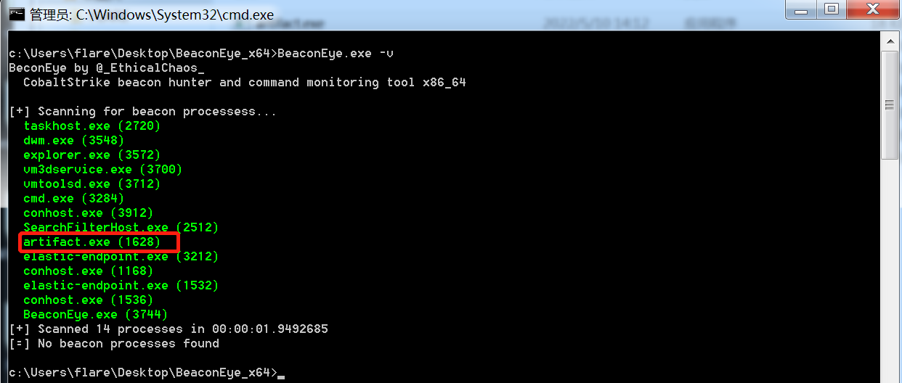

# BlueHound

BlueHound 是一款GUI版本主机威胁狩猎工具。支持上机/离线扫描webshell、CobaltStrike的beacon程序扫描以及内存扫描，基于.NET 4.6编译。

## 支持系统

- **Windows 10 x64**

- **Windows Server 2012 R2 x64及以上**

- **其他安装了.NET framework 4.6及以上的x64位操作系统**

  

## 简介

三个选项功能如下：

- **WebShell** - 扫描webshell,可以在上机排查的时候直接选择web应用目录扫描，或者将受害机上的文件拷贝到自己的机器离线扫描
- **Beacon** - 扫描进程内存中可能存在的CobaltStrike的beacon程序
- **MemHunter** - 扫描进程内存，导出存在可疑注入内容的内存dmp文件

## 使用方法

1. 拷贝整个文件夹至需要调查的主机上
2. 以管理员权限启动“BlueHound.exe”
3. 按需选择要调查项目

## 检测效果

### WebShell

出于威胁狩猎的目的，所以检测特征写的比较宽泛，在使用过程中可能会出现一些误报。

### Beacon

Beacon选项主要扫描进程内存中可能存在的CobaltStrike beacon程序、C2 profile。可以扫描出绕过BeaconEye的beacon程序，执行原版beacon程序上线后，管理员权限启动BlueHound,选择Beacon扫描结果如下：

#### Stage

BeaconEye扫描被绕过，但是自研的增强beacon扫描功能扫描出了C2 profile特征，并导出了C2 profile所在的内存为dmp文件。可以用十六进制编辑器打开dmp文件后使用cyberchef做异或解密，如上图BlueHound会给出异或的key,本例中为`0x2e`

或者使用开源工具[CobaltStrikeParser](https://github.com/Sentinel-One/CobaltStrikeParser)解析导出的dmp文件

PS：如果BlueHound扫描出来的异或key不是`0x2e`那么需要按需修改CobaltStrikeParser里的脚本进行适配

#### Stageless

对于stageless的beacon会扫描进程内存空间狩猎符合beacon程序内存特征的进程

### MemHunter

MemHunter主要扫描进程内存中是否被注入可疑PE文件，如果是会dump出可疑文件所在内存dmp文件供分析。还是用绕过了上述扫描手段的beacon程序为例。

#### Inject

转储文件拖至IDA分析

## Q&A

Q：一些正常文件、进程被扫出来威胁？

A：由于是威胁狩猎工具，所以会存在一些误报，总体来说除了webshell扫描模块，误报还是比较可控的

## TO-DO

- 命令行版本
- 支持syslog外发告警信息
- MemHunter导出PE文件时自动修复IAT